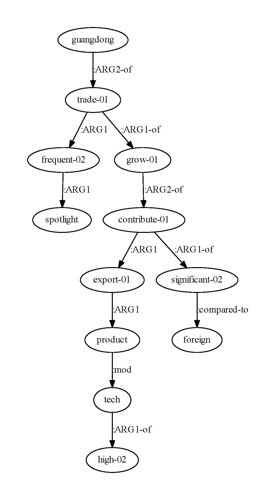

# AMR-Visualization
AMR-Visualization Tools, show AMR graph structure.

Abstract Meaning Representation Visualization 

## Quickstart

```python
python amr-slide-simple.py AMR-file.txt
or
python amr-slide-single-line.py AMR-file-with-single-line-format.txt
```

- Python3.5+

- Your input should be raw AMR format (likes [JAMR](https://github.com/jflanigan/jamr)).

- Install [graphviz](https://pypi.org/project/graphviz/)

  Remember to configure environment variables after installing graphviz

- Output is PDF, it is easy to convert 2 picture

## Example

AMR-file.txt

```
# ::snt export of high-tech products has frequently been in the spotlight , making a significant contribution to the growth of foreign trade in guangdong .
# ::tok export of high - tech products has frequently been in the spotlight , making a significant contribution to the growth of foreign trade in guangdong .
# ::alignments 24-25|0 22-23|0.0 21-22|0.0.1.0.1.0 19-20|0.0.1 16-17|0.0.1.0 15-16|0.0.1.0.1 11-12|0.0.0.0 7-8|0.0.0 5-6|0.0.1.0.0.0 4-5|0.0.1.0.0.0.0 2-3|0.0.1.0.0.0.0.0 0-1|0.0.1.0.0 ::annotator JAMR dev v0.3 ::date 2019-07-08T23:42:17.243
(g / guangdong
      :ARG2-of (t / trade-01
            :ARG1 (f2 / frequent-02
                  :ARG1 (s2 / spotlight))
            :ARG1-of (g2 / grow-01
                  :ARG2-of (c / contribute-01
                        :ARG1 (e / export-01
                              :ARG1 (p / product
                                    :mod (t2 / tech
                                          :ARG1-of (h / high-02))))
                        :ARG1-of (s / significant-02
                              :compared-to (f / foreign))))))

```

AMR-file-with-single-line-format.txt

```
gold :op1 interrogative
know :arg0 you :arg1 it :beneficiary interrogative :mod ( country :name ( name :op1 wouldn )  )  :polarity -
(g / guangdong :ARG2-of (t / trade-01 :ARG1 (f2 / frequent-02 :ARG1 (s2 / spotlight)) :ARG1-of (g2 / grow-01 :ARG2-of (c / contribute-01 :ARG1 (e / export-01 :ARG1 (p / product :mod (t2 / tech :ARG1-of (h / high-02)))) :ARG1-of (s / significant-02 :compared-to (f / foreign))))))
```


Visualization(Demo Only Show Multi-line)

```
digraph "AMR-Graph" {
	rankdir=TB
	f2 [label="frequent-02"]
	s2 [label=spotlight]
	f2 -> s2 [label=":ARG1"]
	t [label="trade-01"]
	f2 [label="frequent-02"]
	t -> f2 [label=":ARG1"]
	t2 [label=tech]
	h [label="high-02"]
	t2 -> h [label=":ARG1-of"]
	p [label=product]
	t2 [label=tech]
	p -> t2 [label=":mod"]
	e [label="export-01"]
	p [label=product]
	e -> p [label=":ARG1"]
	c [label="contribute-01"]
	e [label="export-01"]
	c -> e [label=":ARG1"]
	s [label="significant-02"]
	f [label=foreign]
	s -> f [label=":compared-to"]
	c [label="contribute-01"]
	s [label="significant-02"]
	c -> s [label=":ARG1-of"]
	g2 [label="grow-01"]
	c [label="contribute-01"]
	g2 -> c [label=":ARG2-of"]
	t [label="trade-01"]
	g2 [label="grow-01"]
	t -> g2 [label=":ARG1-of"]
	g [label=guangdong]
	t [label="trade-01"]
	g -> t [label=":ARG2-of"]
}
```



## Citation

If you would like to cite this work, please cite the following: 
AMR-Visualization,xdqkid, https://github.com/xdqkid/AMR-Visualization

---

# 抽象语义表示可视化工具
## 快速入门

```python
python amr-slide-simple.py AMR-file.txt
or
python amr-slide-single-line.py AMR-file-with-single-line-format.txt
```

- Python3.5+

- AMR格式参考[JAMR](https://github.com/jflanigan/jamr)，

- 安装[graphviz](https://pypi.org/project/graphviz/)

  根据平台下载graphviz安装包，配置环境变量，然后pip

- 输出是PDF。如果需要图片格式，那你肯定不是在写论文（逃

## 示例

AMR-file.txt样例文件示意

```
# ::snt export of high-tech products has frequently been in the spotlight , making a significant contribution to the growth of foreign trade in guangdong .
# ::tok export of high - tech products has frequently been in the spotlight , making a significant contribution to the growth of foreign trade in guangdong .
# ::alignments 24-25|0 22-23|0.0 21-22|0.0.1.0.1.0 19-20|0.0.1 16-17|0.0.1.0 15-16|0.0.1.0.1 11-12|0.0.0.0 7-8|0.0.0 5-6|0.0.1.0.0.0 4-5|0.0.1.0.0.0.0 2-3|0.0.1.0.0.0.0.0 0-1|0.0.1.0.0 ::annotator JAMR dev v0.3 ::date 2019-07-08T23:42:17.243
# 前面有#号都可以忽略，重要的是下面的AMR图，AMR图之间用空行分隔开。
(g / guangdong
      :ARG2-of (t / trade-01
            :ARG1 (f2 / frequent-02
                  :ARG1 (s2 / spotlight))
            :ARG1-of (g2 / grow-01
                  :ARG2-of (c / contribute-01
                        :ARG1 (e / export-01
                              :ARG1 (p / product
                                    :mod (t2 / tech
                                          :ARG1-of (h / high-02))))
                        :ARG1-of (s / significant-02
                              :compared-to (f / foreign))))))

```

AMR-file-with-single-line-format.txt样例文件示意，即单行简化的AMR图。

```
gold :op1 interrogative
know :arg0 you :arg1 it :beneficiary interrogative :mod ( country :name ( name :op1 wouldn )  )  :polarity -
(g / guangdong :ARG2-of (t / trade-01 :ARG1 (f2 / frequent-02 :ARG1 (s2 / spotlight)) :ARG1-of (g2 / grow-01 :ARG2-of (c / contribute-01 :ARG1 (e / export-01 :ARG1 (p / product :mod (t2 / tech :ARG1-of (h / high-02)))) :ARG1-of (s / significant-02 :compared-to (f / foreign))))))
```

可视化（这里仅展示多行，单行效果相同）

```
digraph "AMR-Graph" {
	rankdir=TB
	f2 [label="frequent-02"]
	s2 [label=spotlight]
	f2 -> s2 [label=":ARG1"]
	t [label="trade-01"]
	f2 [label="frequent-02"]
	t -> f2 [label=":ARG1"]
	t2 [label=tech]
	h [label="high-02"]
	t2 -> h [label=":ARG1-of"]
	p [label=product]
	t2 [label=tech]
	p -> t2 [label=":mod"]
	e [label="export-01"]
	p [label=product]
	e -> p [label=":ARG1"]
	c [label="contribute-01"]
	e [label="export-01"]
	c -> e [label=":ARG1"]
	s [label="significant-02"]
	f [label=foreign]
	s -> f [label=":compared-to"]
	c [label="contribute-01"]
	s [label="significant-02"]
	c -> s [label=":ARG1-of"]
	g2 [label="grow-01"]
	c [label="contribute-01"]
	g2 -> c [label=":ARG2-of"]
	t [label="trade-01"]
	g2 [label="grow-01"]
	t -> g2 [label=":ARG1-of"]
	g [label=guangdong]
	t [label="trade-01"]
	g -> t [label=":ARG2-of"]
}
```


## 引用

如果你用了本工具，请引用如下文字

AMR-Visualization，xdqkid,  https://github.com/xdqkid/AMR-Visualization